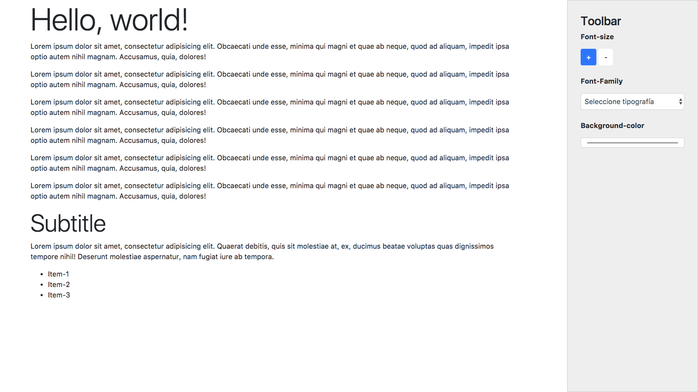
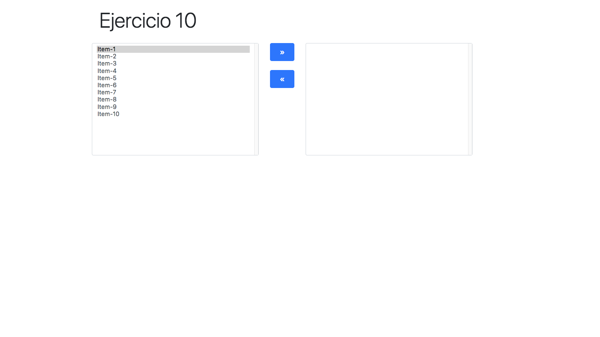

# Workshop Eventos JQuery:


**INSTRUCCIONES**:

Resuelve los siguientes ejercicios basados en JQUERY usando todo lo aprendido en clases:

## Tomar en cuenta

- Se debe utilizar **GIT para el control de versiones**.
- Al finalizar, guarda los cambios y súbelos a **Github**.
- Subir el link del repositorio a la sección correspondiente en la plataforma [empieza](https://empieza.desafiolatam.com "Desafío Latam").

## Ejercicios:

### Ejercicio 1

El siguiente código debería reemplazar un elemento de la página, pero por algún motivo (o varios) no funciona, hay que arreglarlo.

```html
<!DOCTYPE html>
<html lang="en">
<head>
    <meta charset="UTF-8">
    <title>Ejercicio</title>
    <link rel="stylesheet" href="https://code.jquery.com/jquery-­‐2.2.1.min.js">
    <script src="prueba.js">
</head>
<body>
    <p id="p1">Hola</p>
</body>
</html>

```

```javascript
$(".p1").html("Nuevo parrafo")
```

*HINT: utilizar el inspector de elementos y la consola de javascript del navegador.*

### Ejercicio 2

Se tiene el siguiente HTML 

```html
<!DOCTYPE html>
<html>
<head>
    <style>
        .box {
            height:100px;
            width:500px;
            padding:10px;
            border:1px solid blue;
            background-color:lightblue;
        }
	
        .box p {
            background-color:pink;
        }
    </style>
</head>
<body>
    <div class="box">
        This is a div element.
        <p>This is a p element, in the div element. <br></p>
    </div>
	
    <script src="https://code.jquery.com/jquery-3.3.1.slim.min.js"></script>
    <script>
        
    </script>
</body>
	
</html>
```
Se pide implementar una solución, que al hacer click en el div este cambio de color (El cambio de color debe ser aleatorio), pero esto no debe pasar cuando se haga click en los elementos que están dentro del div. 

*Hint: Bubbling & Math.random()*

### Ejercicio 3
Se tiene la siguiente página web:

```html
	<!DOCTYPE html>
	<html lang="en">
	<head>
	    <meta charset="UTF-8">
	    <title>Document</title>
	    <link rel="stylesheet" href="http://code.jquery.com/jquery‐2.2.1.js">
	</head>
	<body>
	    <ul>
	        <li>1</li>
	        <li>2</li>
	        <li>3</li>
	        <li>4</li>
	        <li>5</li>
	    </ul>
	</body>
	</html>
```

* Se pide agregar un botón a la página que al presionarlo agregue el elemento 6, luego el 7 y así sucesivamente.

* Se pide agregar un botón que elimine el primer elemento de la lista. (debe seguir con el conteo ascendente aunque se agregue al inicio de la lista)

### Ejercicio 4
Se pide hacer un formulario web usando bootstrap, que tenga un input, que permita ingresar un nombre, un input para ingresar un email y un dropdown que permita seleccionar el género de un usuario.

Al hacer click en enviar se pide:
	- Validar que el email no sea vacío.
	- Ingresar los datos dentro del objeto persona.

### Ejercicio 5
Dado el siguiente HTML



Se pide crear las funcionalidades que permitan agrandar el tamaño de los párrafos del documento, cambiar la tipografía y color fondo dinámicamente.

El HTML base lo puedes descargar del siguiente [enlace](src/html/ejercicio5.html)

### Ejercicio 6
Crear un documento HTML y cargar una imagen con la etiqueta img de HTML. Capturar los eventos de tecla para permitir mover la imagen utilizando las flechas de derecha e izquierda (La imagen se deberá poder mover 50px en la dirección respectiva).

### Ejercicio 7
Utiliza los métodos focus() y blur() para cambiar el color de dos cuadros de texto cuando posicionamos el foco y cuando lo retiramos.

### Ejercicio 8 
Crea un documento con un párrafo tal que aparezca un aviso alert() cuando se presiona el botón izquierdo del ratón.

### Ejercicio 9
Utiliza el método hover() para lanzar un mensaje cuando nos posicionamos sobre un párrafo y otro cuando salgamos de él.

### Respuesta 10

Se pide construir la siguiente interfaz, el objetivo es desarrollar las funcionalidades que permita agregar o eliminar elementos, es decir, mover los objetos de izquierda a derecha y viceversa.



Como base puedes tomar el siguiente [HTML](src/html/ejercicio10.html).